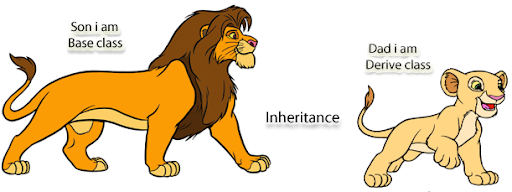

# Assignment 2 : Kontorola 👣

## Aim 🏹

- Apply OOP basics in PHP

## Instructions

1. Review the contents of the file named Kontorola.php, it contains an array of users which mimics a database resultSet.
2. Create a new class named User that has the users array as a private property and any other relevant properties.
3. In User,create class methods that will return;
   1. Return a list of all users (name & email)
   2. Return a list of all female users(name).
   3. Return users with two names
4. Create another class called Admin such that it returns all admin users when instantiated.
5. In the file named Kontorola.php, write a few test cases for your classes.

>NB : Marks will be awarded for proper submission,correctness and adhering to the OOP best practices as discussed so far in class and also explored by you during the group work.

> Success 🙌
